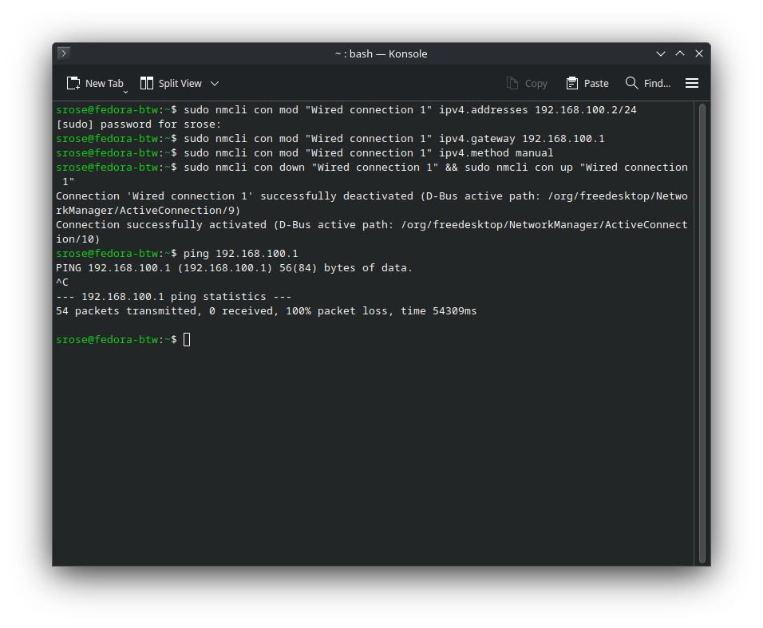
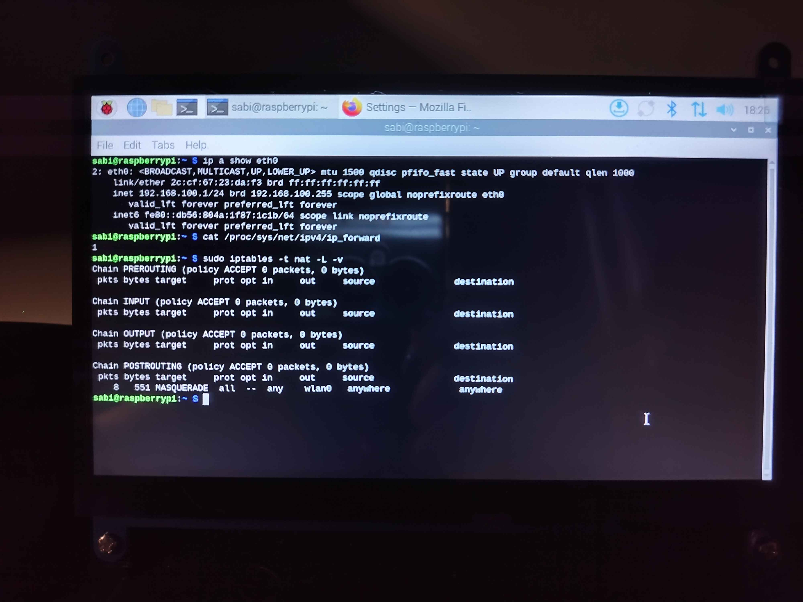
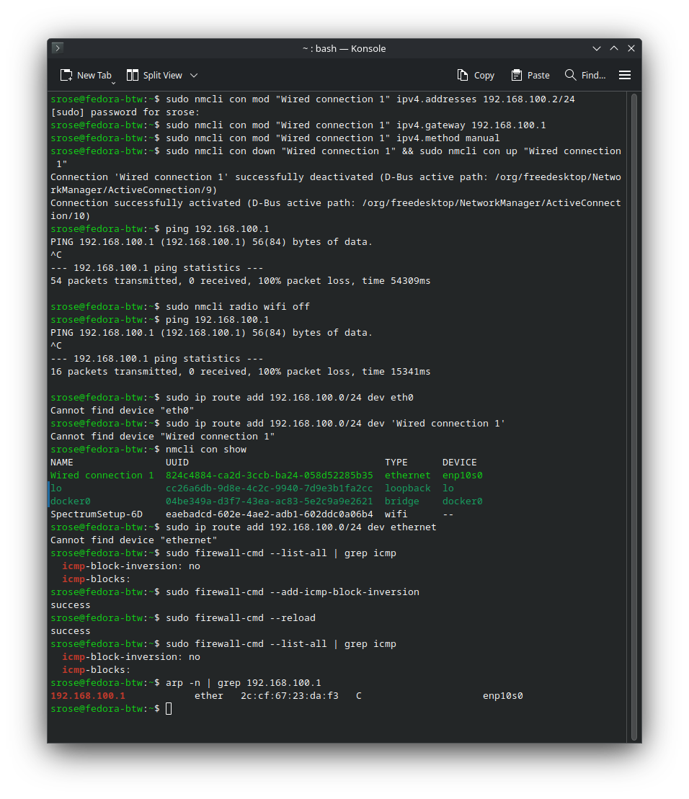
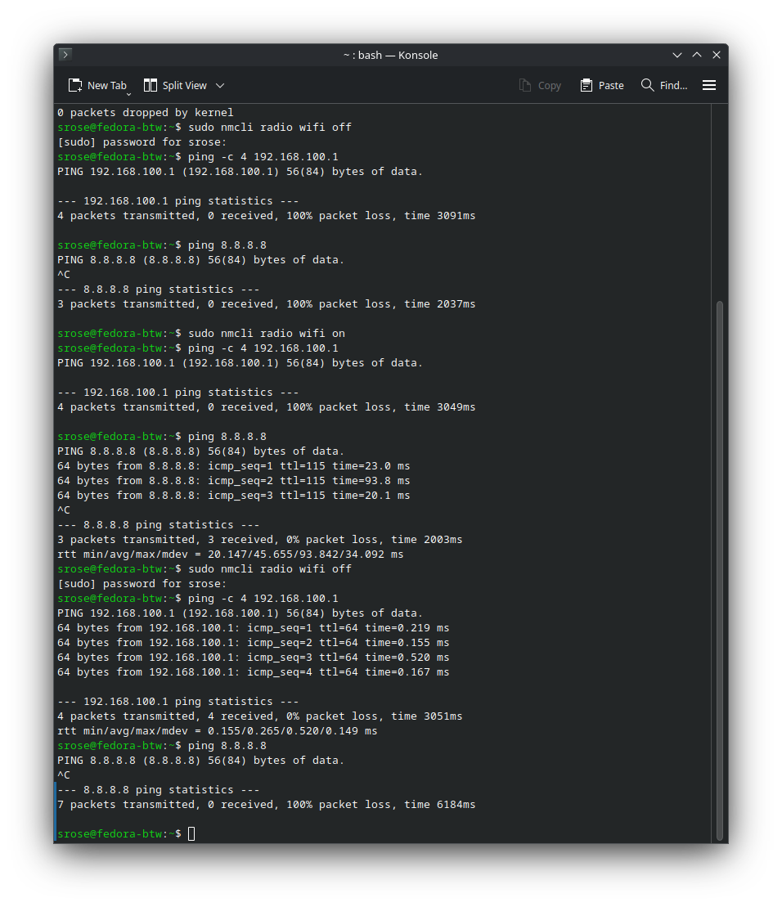

# CCNA Static IP Routing Lab: Raspberry Pi as a Router

## Date
2025-07-31

## Author
@sabrinaderose

## Repository
[GitHub Repo](https://github.com/sabrinaderose/ccna-static-ip-routing-lab)

## Category
Homelab | Networking | CCNA Practice | Documentation

## Related Certifications
Cisco CCNA, CompTIA Network+

---

## Objective

Configure a Raspberry Pi 5 as a router with NAT to share its Wi-Fi internet connection via Ethernet, simulating enterprise routing scenarios. Validate connectivity, troubleshoot asymmetric routing, and document real-world constraints (e.g., ICMP blocking).

---

## Environment & Tooling

### Hardware

- **Raspberry Pi 5** – 4GB RAM, Raspberry Pi OS 64-bit (Debian Bookworm)
- **Fedora Workstation** – Ethernet port, Fedora Linux 42
- **Peripherals** – iPistBit 7" Touchscreen, Vilros USB Keyboard

### Software

- **Raspberry Pi** – `iptables`, `dnsmasq`, `NetworkManager`
- **Fedora** – `nmcli`, `tcpdump`, `firewalld`

---

## Network Topology

```
[Fedora Client] <--eth0--> [Raspberry Pi 5] <--wlan0--> [Internet]  
```

---

## Step-by-Step Process

### Phase 1: Preparation

Backup Pi’s config:
```bash
sudo cp /etc/network/interfaces /etc/network/interfaces.bak
```

> **Justification:** Used `iptables` for NAT (aligned with CCNA’s focus on legacy tools).

---

### Phase 2: Configuration

**On Raspberry Pi:**

Assign static IP to `eth0`:
```bash
sudo nmcli con mod "Wired connection 1" ipv4.addresses 192.168.100.1/24
```

Enable IP forwarding:
```bash
echo 1 | sudo tee /proc/sys/net/ipv4/ip_forward
```

Add NAT rule:
```bash
sudo iptables -t nat -A POSTROUTING -o wlan0 -j MASQUERADE
```

**On Fedora:**
```bash
sudo nmcli con mod "Wired connection 1" ipv4.addresses 192.168.100.2/24
sudo nmcli con mod "Wired connection 1" ipv4.gateway 192.168.100.1
```

---

### Phase 3: Testing

**Expected:**

- Bidirectional pings (Fedora ↔ Pi)
- Internet access via NAT

**Actual:**

- ❌ Pings failed due to route conflicts (Fedora’s WiFi overriding Ethernet)
- ✅ Internet worked only for HTTPS (ICMP/HTTP blocked by network)

---

### Phase 4: Troubleshooting

**Fixed Route Conflict:**
```bash
sudo ip route del default via 192.168.1.1  # Remove WiFi default route
```

**Allowed ICMP on Pi:**
```bash
sudo iptables -A INPUT -p icmp -j ACCEPT
```

**Verified with tcpdump:**
```bash
sudo tcpdump -i eth0 icmp  # Confirmed packets reached Pi but were blocked
```

---

## Analysis & Reflection

**Successes:**

- Achieved static routing and NAT.
- Documented real-world behaviors (e.g., protocol filtering).

**Challenges:**

- Asymmetric routing due to dual default routes.
- Network policies blocking raw ICMP/HTTP.

**Lessons:**

- Always verify default routes with `ip route`.
- Prefer `curl -k https://` for testing in restricted networks.

---

## Final Outcome

✅ **Achieved:**

- Fedora accesses internet via Pi’s NAT
- Pi ↔ Fedora pings work after firewall fixes

⚠️ **Limitations:**

- Internet sluggish due to Pi’s Wi-Fi bottleneck
- Discord blocked (likely UDP/ICMP restrictions)

---

> The following images are embedded below for clarity, documentation, and reference within this lab.

---

### **Fedora Ethernet Configuration & Routing Conflict**  



*Shows Fedora's Ethernet interface (enp10s0) with static IP 192.168.100.2/24 and conflicting default routes (WiFi wlp9s0 and Ethernet enp10s0). The tcpdump output confirms ICMP requests to the Pi (192.168.100.1) were sent but initially blocked.*

---

### **Pi Routing Table & ARP Entry**  


*Raspberry Pi's routing table showing dual default routes (WiFi wlan0 and Ethernet eth0) and the ARP entry for Fedora (192.168.100.2). Later, ICMP rules were added to fix bidirectional ping.*

---

### **Pi NAT Verification**  



*Confirms Pi’s static IP (192.168.100.1/24), enabled IP forwarding (ip_forward=1), and NAT rule (MASQUERADE on wlan0) using iptables -t nat -L.*

---

### **Fedora Routing Before Fix**  


*Fedora’s ip route output before fixes, showing competing default routes (WiFi 192.168.1.1 and Ethernet 192.168.100.1), causing connectivity issues.*

---

### **Fedora Routing During Fix**  



*Debugging steps: Disabled WiFi, attempted to add static routes, and checked firewall rules. Shows the moment before resolving the route conflict.*

---

### **Final Ping Tests**  



*Successful ping from Fedora to Pi (192.168.100.1) after fixing routes, but internet access fails due to NAT/WiFi bottleneck. Demonstrates split connectivity.*

---

## Interview Summary (STAR Format)

- **Situation:** Needed to simulate a router using a Raspberry Pi for CCNA practice  
- **Task:** Configure NAT, static IPs, and troubleshoot asymmetric routing  
- **Action:** Used `iptables`, `nmcli`, and `tcpdump` to diagnose route conflicts and firewall blocks  
- **Result:** Successfully routed traffic, documenting protocol restrictions and workarounds  

---

## References

- [Cisco CCNA Routing Labs](https://learningnetwork.cisco.com/s/)
- [iptables Documentation](https://netfilter.org/documentation/)
- [NetworkManager CLI Guide](https://networkmanager.dev/docs/api/latest/)
